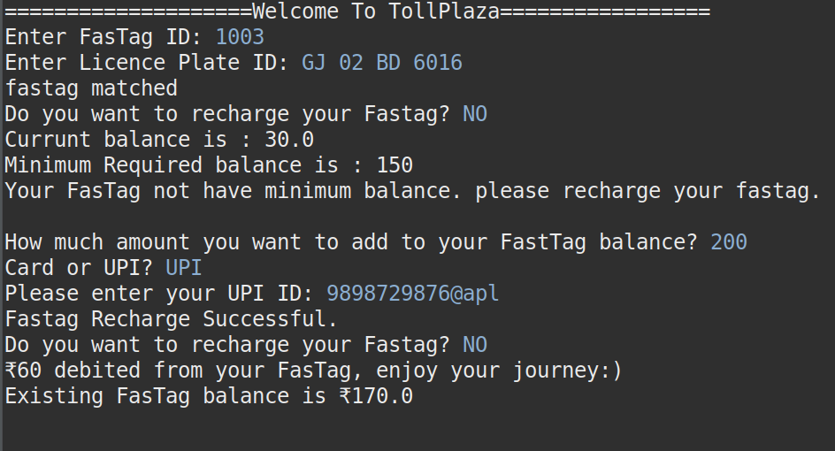
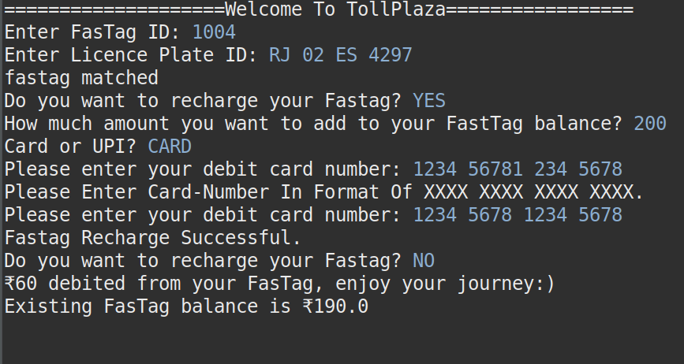

# FasTag-Console-based-program-in-JAVA

## Introduction

Build a console-based interface using Java that simulates the operation of a toll plaza that
uses the FasTag technology. You are supposed to build a system for the operator who
manages a single toll plaza where different kinds of vehicles pass through.
Every FasTag account has a License Plate ID, Vehicle Category ID and a FasTag ID
associated with it.
The Vehicle Categories are:
1. 2-wheeler
2. 3-wheeler
3. Light Motor Vehicle - noncommercial
4. Light Motor Vehicle - commercial
5. Heavy Motor Vehicle - noncommercial
6. Heavy Motor Vehicle - commercial

Every FasTag has an account balance associated with it.
FasTag accounts have a minimum balance based on the Vehicle Category

Basic Operations
1. Recognize Vehicle: Vehicles must be initialized with a specific FasTag ID.
2. Recharge Fastag: FasTag IDs must be rechargeable through a debit card or through
UPI ID. The payment instrument should be of the format XXXX XXXX XXXX XXXX, all
numeric, or through UPI, which should be of the format
<addressname>@<providername> where address name should conform to the
regex [a-zA-Z0-9._-] and providername should conform to the regex [a-z]. Detailed
error messages should be displayed if the input doesn’t pass these validations.
3. Pay Toll: If the FasTag account has minimum balance, deduct the toll amount from
the FasTag based on the following rate card. Otherwise, prompt the user to recharge
their FasTag.

## screenshots

